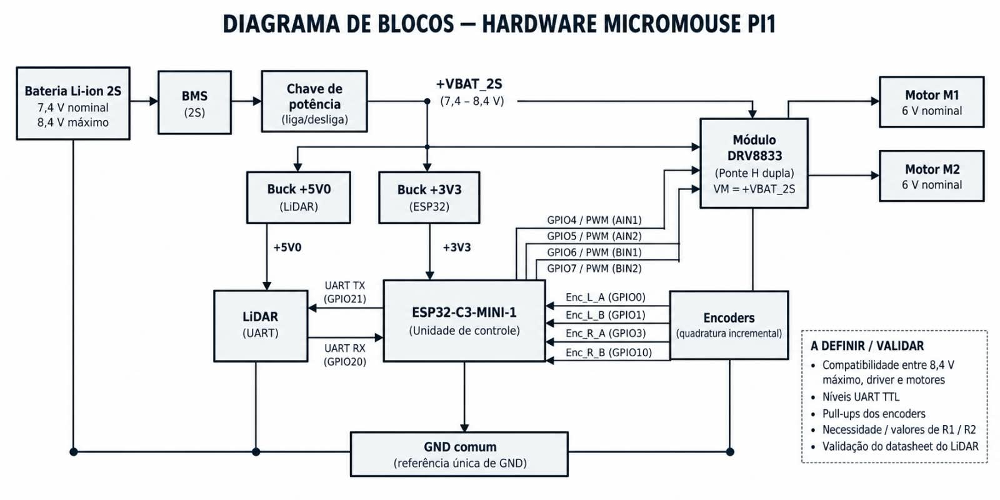
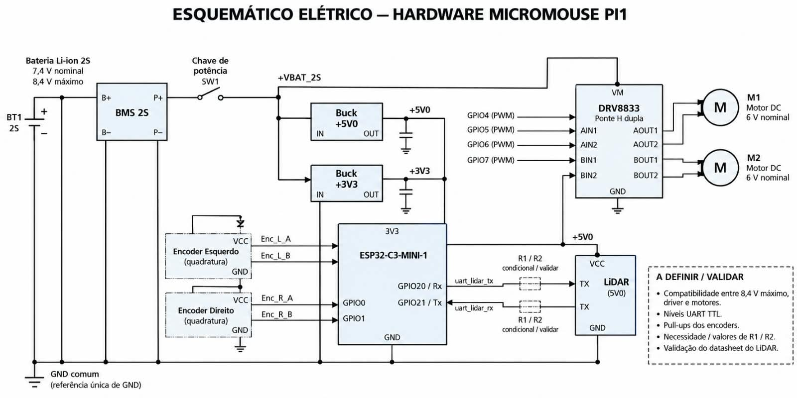

# Diagramas de _Hardware_ — Micromouse PI1

Esta página apresenta a arquitetura de _hardware_ do Micromouse por meio de dois artefatos complementares: o **diagrama de blocos**, com a visão geral dos subsistemas e das conexões entre eles, e o **esquemático elétrico**, com os componentes, símbolos, ligações e pinagem dos dispositivos.

A arquitetura organiza-se em quatro domínios: **energia** (bateria, proteção e regulação), **controle** (microcontrolador e _driver_), **atuação** (motores) e **sensoriamento e comunicação** (encoders e LiDAR). O dimensionamento de consumo e a escolha da fonte são detalhados em [4.2 Energia](energia.md).

---

## 1. Diagrama de blocos

O diagrama de blocos apresenta a visão geral do _hardware_, indicando os principais subsistemas e o fluxo de energia e de sinais entre eles.

<figure markdown>

{ width="900" }

<figcaption>

**Figura 1.** Diagrama de blocos do _hardware_ do Micromouse PI1, com os subsistemas de energia, controle, atuação e sensoriamento.

</figcaption>

</figure>

### Fluxo de energia

* **Bateria Li-ion 2S** — 7,4 V nominal e 8,4 V máximo (carga plena).
* **BMS (2S)** — gerenciamento da bateria: proteção contra subtensão, curto-circuito e balanceamento das células.
* **Chave de potência (liga/desliga)** — comando geral da alimentação, em série com a saída do BMS.
* **Barramento +VBAT_2S (7,4–8,4 V)** — distribui a tensão não regulada para os conversores e para o _driver_ de motores.
* **Conversor Buck +5V0** — linha regulada de 5,0 V dedicada ao LiDAR.
* **Conversor Buck +3V3** — linha regulada de 3,3 V para o ESP32-C3-MINI-1, os encoders e a lógica do DRV8833.
* **GND comum** — referência única de terra para todo o sistema.

### Controle e atuação

* **ESP32-C3-MINI-1** — unidade de controle, alimentada em +3V3.
* **Módulo DRV8833 (ponte H dupla)** — recebe `VM = +VBAT_2S` diretamente do barramento (sem regulador intermediário de 6 V) e aciona os dois motores. Os canais lógicos são comandados por PWM do MCU:
    * `GPIO4 → AIN1`, `GPIO5 → AIN2` (Motor M1);
    * `GPIO6 → BIN1`, `GPIO7 → BIN2` (Motor M2).
* **Motores M1 e M2** — motores DC de 6 V nominal, acionados pelas saídas `AOUT1/AOUT2` e `BOUT1/BOUT2`.

### Sensoriamento e comunicação

* **Encoders (quadratura incremental)** — leitura de rotação das rodas via GPIO:
    * `Enc_L_A → GPIO0`, `Enc_L_B → GPIO1` (roda esquerda);
    * `Enc_R_A → GPIO3`, `Enc_R_B → GPIO10` (roda direita).
* **LiDAR (UART, +5V0)** — comunicação serial com o MCU:
    * `UART TX (GPIO21)` do ESP32 → recepção do LiDAR;
    * transmissão do LiDAR → `UART RX (GPIO20)` do ESP32, com divisor **R1/R2 condicional** para adequação de nível, quando necessário.

---

## 2. Esquemático elétrico

O esquemático elétrico detalha os componentes, os símbolos elétricos, as conexões e a pinagem de cada dispositivo, permitindo a reprodução do circuito.

<figure markdown>

{ width="900" }

<figcaption>

**Figura 2.** Esquemático elétrico do _hardware_ do Micromouse PI1, com pinagem do MCU, do _driver_ DRV8833, dos encoders e do LiDAR.

</figcaption>

</figure>

### Alimentação e distribuição

* A bateria **BT1 (Li-ion 2S)** conecta-se ao **BMS 2S** pelos terminais `B+/B−`, com saída protegida em `P+/P−`.
* A **chave de potência (SW1)** interrompe a linha `P+`, gerando o barramento **+VBAT_2S**.
* O barramento +VBAT_2S alimenta, em paralelo, os conversores **Buck +5V0** e **Buck +3V3** (entradas `IN`, saídas `OUT` com capacitor de saída) e o pino **VM** do DRV8833.
* Todos os blocos compartilham o **GND comum** (referência única de GND).

### Controle e _driver_

* O **ESP32-C3-MINI-1** é alimentado em **3V3** e comanda o **DRV8833 (ponte H dupla)**:
    * `GPIO4 (PWM) → AIN1`, `GPIO5 (PWM) → AIN2`, `GPIO6 (PWM) → BIN1`, `GPIO7 (PWM) → BIN2`.
    * Saídas de potência `AOUT1/AOUT2 → Motor M1` e `BOUT1/BOUT2 → Motor M2` (motores DC de 6 V nominal).

### Sensores

* **Encoder Esquerdo** — `Enc_L_A` e `Enc_L_B` conectados a `GPIO0`/`GPIO1`, com alimentação `VCC` e `GND`.
* **Encoder Direito** — `Enc_R_A` e `Enc_R_B`, com alimentação `VCC` e `GND`.
* **LiDAR (+5V0)** — pinos `TX`/`RX` ligados a `GPIO20 / Rx` e `GPIO21 / Tx` do ESP32, com blocos **R1/R2 condicionais** nas linhas `uart_lidar_tx` e `uart_lidar_rx` para adequação de nível.

---

## 3. Pontos a definir / validar

Itens críticos sinalizados nos diagramas que dependem de confirmação em bancada e nas folhas de dados:

- [ ] Compatibilidade entre os **8,4 V máximos** do barramento e os limites do _driver_ e dos motores (nominais de 6 V).
- [ ] **Níveis UART TTL** entre o ESP32-C3 e o LiDAR.
- [ ] Necessidade de **pull-ups nos encoders**.
- [ ] Necessidade e **valores de R1 / R2** para o divisor do LiDAR.
- [ ] **Validação do datasheet do LiDAR** (protocolo, alimentação e compatibilidade elétrica).

> **Observação:** a proteção dos motores de 6 V sob bateria plena (8,4 V) é tratada por **limitação de _duty cycle_ via software** no PWM do ESP32-C3, conforme detalhado em [4.2 Energia](energia.md).
