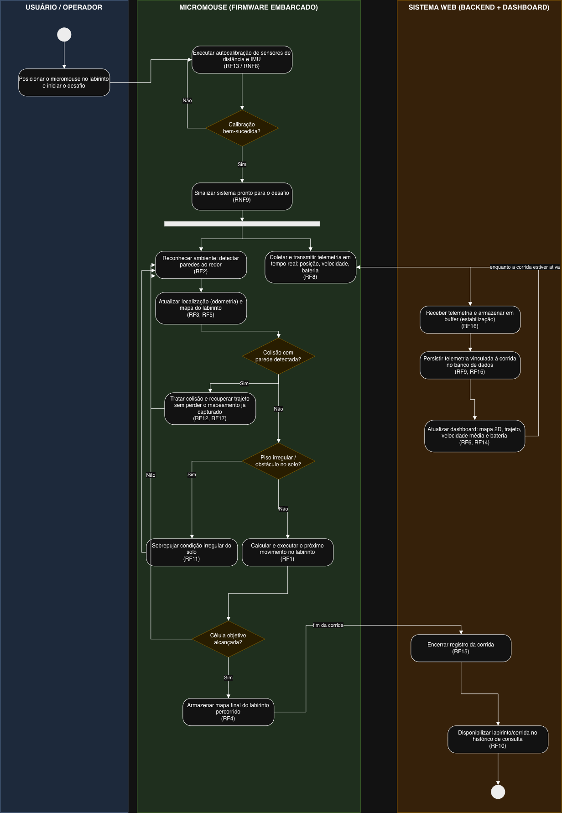

# Projeto Conceitual de Software

- [Explicações adicionais](https://drive.google.com/file/d/1WWIz6609c7Y7zAQRBWHSbX0t2vEJ2z1A/view?usp=sharing)
- [Noções de UML](https://drive.google.com/file/d/1l1yt2ittHuRKIXVXYT76P1HriR07pK-t/view?usp=sharing)
- [Requisitos](https://engsoftmoderna.info/cap3.html)

> **Itens fundamentais:**
> - **Diagrama Atividades UML:** descrever e explicar o fluxo do comportamento funcional do produto proposto, evidenciando, de forma clara e estruturada, como as atividades são executadas, em que ordem e sob quais condições. Esse diagrama permite compreender o funcionamento dinâmico do sistema, destacando:
>   - os principais atores (usuários ou sistemas externos) envolvidos no processo;
>   - as atividades de negócio realizadas por cada ator ou pelo próprio sistema;
>   - os insumos (entradas) necessários para a execução das atividades;
>   - os resultados (saídas) gerados ao longo do fluxo;
>   - os pontos de decisão, paralelismo e sincronização das atividades;
>   - Entre as notações mais relevantes, destacam-se o estado inicial e final, atividades, nós de decisão e junção, barras de bifurcação, Raias (*swimlanes*) e Fluxos de controle.
> - **_Backlog_ do Produto**
>   - Detalhar os requisitos funcionais (RF) com a técnica de documentação e especificação de história de usuário (HU);
>   - Protótipos de interface gráfica do *software* em alta fidelidade.
>     - **Todas HUs devem conter sua descrição (Eu-Como-Para), critérios de aceitação e protótipos de interface, documentadas no github.**
>   - Exporte as informações do Backlog do Produto no GitHub Projects [em formato CSV](https://docs.github.com/en/issues/planning-and-tracking-with-projects/managing-your-project/exporting-your-projects-data), e [renderize em Markdown](https://www.google.com/search?q=convert+CSV+file+to+Markdown+table) no formato a seguir:

### Diagrama de Atividades UML

O diagrama acima descreve o comportamento funcional do software do micromouse, desde o
início do desafio até o encerramento do registro da corrida. O fluxo está organizado em
três raias (*swimlanes*), cada uma representando um ator do sistema:

- **Usuário/Operador**: pessoa responsável por posicionar o robô no labirinto e iniciar o desafio.
- **Micromouse (Firmware)**: sistema embarcado que executa a navegação autônoma, o
  reconhecimento do ambiente e a coleta de telemetria.
- **Sistema Web (Backend + Dashboard)**: sistema externo responsável por receber, persistir
  e exibir os dados de telemetria em tempo real.

#### Fluxo principal

O processo é iniciado pelo **Usuário**, que posiciona o micromouse na célula inicial do
labirinto e sinaliza o início do desafio (insumo: posicionamento físico do robô).

O **Micromouse** então executa uma rotina de autocalibração dos sensores de distância e do
sensor inercial (IMU) (RF13, RNF8). Esse é o primeiro ponto de decisão do fluxo: caso a
calibração falhe, a atividade é repetida até ser bem-sucedida; caso contrário, o sistema
sinaliza que está pronto para o desafio (RNF9).

A partir daí, o fluxo se bifurca em duas atividades que ocorrem **em paralelo** (barra de
bifurcação/*fork*), refletindo o fato de que navegação e telemetria são processos
concorrentes durante toda a corrida:

**1. Navegação pelo labirinto (loop)**
O micromouse reconhece o ambiente ao seu redor, identificando paredes (RF2), atualiza sua
localização por odometria e o mapa do labirinto (RF3, RF5). A cada ciclo, dois pontos de
decisão tratam condições excepcionais: se uma colisão com parede é detectada, o sistema
trata a colisão e retoma a exploração sem perder o mapeamento já capturado (RF12, RF17); se
o piso apresenta irregularidades, o sistema executa uma rotina para sobrepujar o obstáculo
(RF11). Superadas essas condições, o robô calcula e executa o próximo movimento (RF1). Um
terceiro ponto de decisão verifica se a célula objetivo foi alcançada (RF7): em caso
negativo, o ciclo se repete; em caso positivo, o mapa final do labirinto percorrido é
armazenado (RF4), encerrando essa atividade.

**2. Transmissão de telemetria (loop contínuo)**
Em paralelo à navegação, o micromouse coleta e transmite continuamente dados de telemetria
— posição, velocidade e nível de bateria (RF8). Esses dados são recebidos pelo **Sistema
Web**, que primeiro os armazena em um buffer para garantir estabilidade caso haja
interrupções de conexão (RF16), em seguida os persiste no banco de dados, vinculados a um
identificador único de corrida (RF9, RF15), e por fim atualiza o dashboard em tempo real
com o mapa bidimensional, o trajeto percorrido, a velocidade média e o consumo de bateria
(RF6, RF14). Esse ciclo se repete enquanto a corrida estiver ativa.

Quando a atividade de navegação é concluída (mapa final armazenado), o **Sistema Web** é
notificado e encerra o registro da corrida (RF15), disponibilizando o labirinto percorrido
para consulta posterior no histórico (RF10), o que marca o nó final do fluxo.

#### Insumos e resultados

| Insumo | Origem | Resultado | Destino |
|---|---|---|---|
| Posicionamento do robô / início do desafio | Usuário | Próxima ação calculada | Micromouse |
| Leituras dos sensores de distância e IMU | Hardware | Mapa do labirinto e localização atualizados | Micromouse |
| Dados de telemetria (posição, velocidade, bateria) | Micromouse | Registro persistido da corrida | Sistema Web |
| Dados persistidos da corrida | Sistema Web | Dashboard atualizado e histórico consultável | Usuário |

#### Pontos de decisão, paralelismo e sincronização

- **Decisões**: sucesso da calibração; ocorrência de colisão; irregularidade do piso; e
  alcance da célula objetivo — cada uma determina se o fluxo segue adiante ou retorna a uma
  atividade anterior (repetição).
- **Paralelismo**: após a sinalização de sistema pronto, a barra de bifurcação inicia duas
  atividades concorrentes e independentes — navegação e transmissão de telemetria — que são
  executadas simultaneamente durante toda a corrida.
- **Sincronização**: a conclusão da navegação (mapa final armazenado) sincroniza com o
  Sistema Web para o encerramento do registro da corrida, unificando os dois ramos
  paralelos antes do nó final.

### Requisitos Funcionais

<u>RF-00/Épico-00: Título do RF/Épico</u>

| ID (Link Github Projects) | Título | Prioridade |
|:------| :-- | :--- |
| HU-00 | | |
| HU-01 | | |
| HU-02 | | |

<u>RF-01/Épico-01: Título do RF/Épico</u>

| ID (Link Github Projects) | Título | Prioridade |
|:--------------------------| :-- | :--- |
| HU-03                     | | |
| HU-04                     | | |
| HU-05                     | | |

### Requisitos Não-Funcionais

| ID (Link Github Projects) | Título | Prioridade | Rastreabilidade |
|:--------------------------| :-- | :--- |:----------------|
| RNF-01                    | | | RF-00/HU-00     |
| RNF-02                    | | |                 |
| RNF-03                    | | |                 |

> 
> - **Descrição da arquitetura da solução de _software_ proposta:**
>   - Esta subseção deve contemplar o documento de arquitetura do sistema e deve ser estruturado segundo as visões (4+1) previstas no processo unificado (UP): lógica, de processos; implementação, implantação e dados (substituirá a visão de casos de uso).
>   - Propósito do *software* (qual o seu papel no sistema);
>   - Padrão adotado: MVC, MVP, Microsserviços, Monolítico, etc (Justificar);
>   - Linguagens de programação: Java, Python, C#, JavaScript, etc.
>   - *Frameworks* e bibliotecas: Spring Boot, .NET Core, React, Angular, Django, etc.
>   - Banco de dados: Relacional (PostgreSQL, MySQL, etc) X NãoSQL (MongoDB, etc).
>   - Persistência de dados: Modelo Entidade-Relacionamento (MER) e seu respectivo Diagrama Entidade-Relacionamento (DER), aplicáveis quando a solução utiliza banco de dados relacional; alternativamente, diagrama de estrutura de documentos, empregado nos casos em que a arquitetura adota banco de dados não relacional.
> - **Roteiro de testes funcionais:**
>   - Código do caso de teste;
>   - Nome do caso de teste;
>   - Rastreabilidade: Link do(a) RF/HU associado(a);
>   - Objetivo do caso de teste;
>   - Pré-condições do sistema para o teste ser realizado, quando se aplicar;
>   - Descrição dos procedimentos a serem executados para o teste;
>   - Resultado esperado para o teste ser aprovado (pós-condição após realizado o teste);